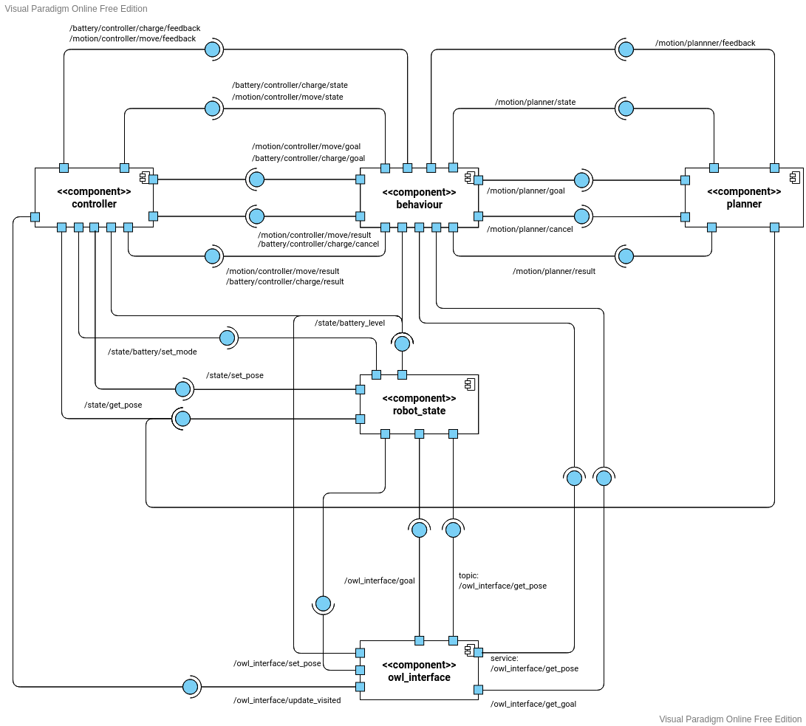

**Institution:** University of Genoa<br>
**Course:** MSc in Robotics Engineering<br>
**Subject:** Experimental Robotics Laboratory<br>
**Author:** ***Alex Thanaphon Leonardi*** <thanaphon.leonardi@gmail.com><br>

# Assignment 1

## 1. Introduction
This is the first assignment of the "Experimental Robotics Laboratory" course, for the Robotics Engineering degree, University of Genoa.

The goal of this assignment was to simulate, through an ontology, an environment
comprised of rooms and corridors, and to move a robot around these rooms based
on priority mechanisms. A Finite State Machine (FSM) represents the robot state.

The FSM is implemented through the [ROS SMACH library](http://wiki.ros.org/smach),
while the ontology is implemented through the [ARMOR framework](https://github.com/EmaroLab/armor).

## 2. Running the program
### Installation
This simulation runs on ROS Noetic. Clone this repository into your ROS workspace's src/ folder:
```
git clone https://www.github.com/ThanaphonLeonardi/exprob-assignment1
```
It also requires [ARMOR](https://github.com/EmaroLab/armor) (follow the
[tutorial presented here](https://github.com/EmaroLab/armor/issues/7)) and the
[ArmorPy API](https://github.com/EmaroLab/armor_py_api):
```
git clone https://github.com/EmaroLab/armor_py_api
```
Additionally, make sure to have [xterm](https://invisible-island.net/xterm/) installed:
```
sudo apt-get install xterm
```

### Execution
Launch the simulation:
```
roslaunch exprob-assignment1 assignment1.launch
```

## 3. Description

The environment is comprised of locations called **rooms** and **corridors**,
connected to each other by **doors**, and a **robot** that can occupy each of
these locations one at a time.<br>
A **room** is an entity that can contain the **robot** and it is characterised
by having only *one* **door** connecting it to another location.
A **corridor** is a **room** with *two or more* **doors**.<br>
Each location is additionally characterised by a numeric data property called
*visitedAt* that represents the last moment it has been visited by the **robot**,
expresed in Unix time (since epoch).\n
Before describing the **robot**'s behaviour, the concepts of *urgency* and
*reachability* should be introduced: a location is considered *reachable* if it
is adjacent to the **robot** and *urgent* if it
has not been visited by the **robot** for a certain amount of seconds, expressed
by the *urgencyThreshold* property of the **robot**.\n
The **robot** exhibits the following behaviour: first, it looks for the next
*reachable* location to visit, following a priority list:
  1. urgent locations
  2. corridors
  3. rooms
Then, it goes to that location and waits for some time (to simulate work), after
which a new location is searched for and so on.\n
During its entire operation, the robot constantly monitors its own battery. If
the battery level falls below the first threshold (battery *low*), then the robot
will finsh up its current work and then immediately after go charge itself. If
however the battery level falls below the second threshold (battery *critical*),
then the robot will immediately stop its work and find a charging station.\n
A location is considered a **charger** if it allows the **robot** to charge. In this
simulation, only the **corridor E** is considered a **charger**.

### Demo Video

## 4. Behind The Scenes

### Extras
The **roslaunch** file is set by default to print to the terminal. The program is
capable of **logging** and can be set to do so, to the default ROS logs, by
modifying the launch file accordingly.

### Finite State Machine

### Component Diagram

#### Component: OWL Interface
#### Component: Robot State
#### Component: Controller
#### Component: Planner
#### Component: Behaviour

### Temporal Diagram

## 5. System Analysis
### Current Limitations
### Possible Improvements
